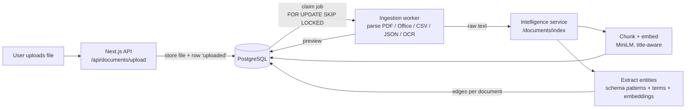
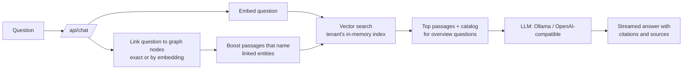
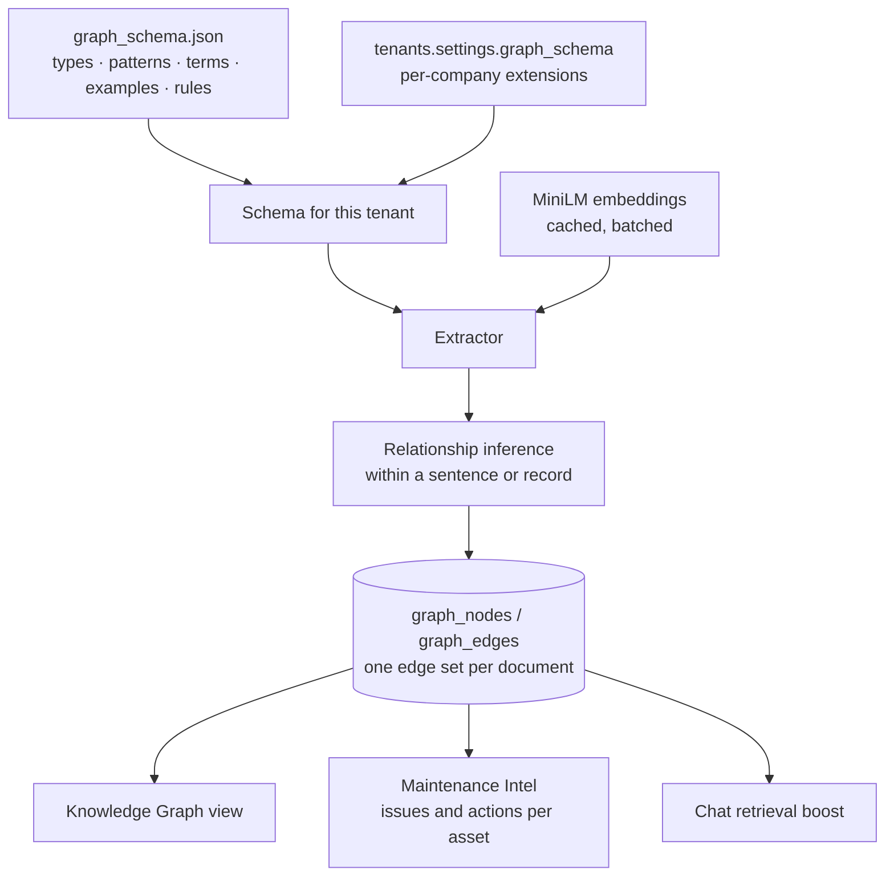

# VEDA AI — Company Knowledge Agent

**Upload your company's documents. Get a chatbot and a knowledge graph that answer from them, and only from them.**

VEDA is a multi-tenant RAG (retrieval-augmented generation) platform. Any company, whether healthcare, finance, manufacturing or anything else, signs up, uploads its files, and gets its own agent: a chat assistant grounded in its documents with citations, a knowledge graph of the assets, issues and actions those documents describe, and dashboards built from them. Nothing about a domain is hardcoded. Entity types, vocabularies and relationship rules are data, and each company can extend them.

---

## Why VEDA

| | |
|:--|:--|
| **One agent per company** | A tenant *is* its agent. Retrieval runs over everything that tenant has uploaded and never touches another tenant's data (every query is tenant-scoped, and PostgreSQL row-level security is enabled). |
| **Grounded answers with sources** | Every answer is built from retrieved passages and cites them `[1]`, `[2]`. The UI shows which documents and passages were used and how long retrieval took. If nothing matches well, the answer says so and points to what the documents *do* cover. |
| **Domain-agnostic knowledge graph** | Entities and relationships come from `graph_schema.json` plus per-tenant extensions, not from code. Embeddings type phrases nobody listed, such as "payment default", "data breach" or "security audit", so a new industry works without code changes. |
| **Efficient embeddings** | One MiniLM model serves search, entity typing and graph linking. Phrase vectors are cached and documents are embedded in one batch each, so typing a document is a single matrix product. Measured on the demo: about 12 ms per document for graph extraction and 6–26 ms per search. |
| **Many formats** | PDF, Word, PowerPoint, Excel, CSV, JSON/JSONL, Markdown, text, and images through OCR. Office files get an in-browser preview. |
| **Runs on a laptop** | Local mode needs only PostgreSQL and Python. There is no Docker, Kafka or vector extension, and Ollama provides a local LLM. Full mode scales out with Kafka, MinIO, pgvector, Apache AGE and OpenSearch. |
| **Private LLM by default** | Chat uses Ollama (local) or any OpenAI-compatible endpoint. Documents never have to leave your infrastructure. |
| **Tested** | 350 Python tests and 220 web tests, a CI workflow, and a demo tenant with scripted end-to-end checks (22 known-answer chat questions). |

---

## How it works

### Upload → index



1. **Upload:** the web app stores the file and queues a `documents` row.
2. **Parse:** the ingestion worker claims the job, picks a parser by file type, extracts text and a preview, and records failures on the document so the upload page can show them.
3. **Index:** the intelligence service splits text into chunks, merging small ones up to 1,500 characters. It embeds each chunk together with its document title and stores the vectors.
4. **Graph:** entities are extracted in four layers:
   - schema regex patterns (asset codes, measurements, regulations)
   - schema term lists
   - embedding-typed key phrases, plus unknown codes typed by the words before them ("loan LN-2041")
   - spaCy NER, if a spaCy model is installed

   Entities in the same sentence or record are linked by the schema's relationship rules. Near-duplicate names merge into existing nodes by cosine similarity.

### Ask → answer



- **Search:** each tenant's vectors are cached in memory and reloaded only when its data changes.
- **Graph steering:** the knowledge graph steers retrieval and never adds passages of its own, so every citation points at real text.
- **Question types:**
  - Greetings skip search.
  - Overview questions ("what topics…?") get a document catalog.
  - Short follow-ups are searched together with the previous question.
  - Weak matches are flagged instead of guessed.

### The knowledge graph



- **Roles:** each type has a role (`subject`, `issue`, `action`, `value` and so on). Views and graph walks use these roles instead of type names.
- **Per-document edges:** edges are stored per source document, so re-indexing or deleting a document updates the graph exactly.
- **Rebuild:** after changing a schema, run `python -m src.knowledge_graph.rebuild --tenant <slug>`.

---

## Architecture

```
apps/web/                  Next.js 15 (App Router, TypeScript)
  src/app/                 pages: landing, login/register, dashboard, chat, upload
  src/app/api/             auth, chat, documents, graph, maintenance, alerts, compliance
  src/components/          KnowledgeGraph, DocumentFindings, DocumentViewer, ...
  src/lib/                 db (tenant-scoped SQL), llm, chatPrompt, intelligence client
services/ingestion/        Python: file parsers, local worker, Kafka worker, previews
services/intelligence/     Python FastAPI
  src/entity_extraction/   graph_schema.json, schema.py, semantic.py, extractor.py
  src/knowledge_graph/     relationships, local_graph, rebuild, AGE manager, Kafka worker
  src/rag/                 pipeline (retrieval), local_store (in-memory vector index)
infrastructure/docker/     PostgreSQL schema (full + local mode), Prometheus
scripts/                   dev.js (starts everything), demo/ (dataset + checks)
demo-data/                 fictional demo company "Nephrova" (72 documents, 8 formats)
```

| Concern | Local mode (default for development) | Full mode |
|:--|:--|:--|
| Queue | PostgreSQL row claiming | Apache Kafka |
| File storage | `.data/uploads` | MinIO |
| Vectors | PostgreSQL `REAL[]` + in-memory numpy index | pgvector (HNSW) |
| Graph | `graph_nodes` / `graph_edges` tables | Apache AGE |
| Keyword search | — | OpenSearch |
| LLM | Ollama | Ollama or any OpenAI-compatible API |

---

## Getting started (local mode)

**Prerequisites:** Node 20+, Python 3.12+, PostgreSQL 16+, and [Ollama](https://ollama.com) for chat.

```bash
# 1. Configuration
cp .env.example .env            # set DATABASE_URL, SESSION_SECRET, INTERNAL_API_KEY, LLM_*

# 2. Database
psql "$DATABASE_URL" -f infrastructure/docker/postgres/init_local.sql
for f in infrastructure/docker/postgres/local/*.sql; do psql "$DATABASE_URL" -f "$f"; done

# 3. Python services (one virtualenv each)
cd services/ingestion    && python -m venv .venv && .venv/Scripts/pip install -e .   # bin/ on Linux/macOS
cd ../intelligence       && python -m venv .venv && .venv/Scripts/pip install -e .

# 4. A local model
ollama pull llama3

# 5. Run everything (web on :3000, intelligence on :8002, ingestion worker)
npm run dev
```

`scripts/dev.js` installs the frontend dependencies, starts both Python services with local-mode settings, and preloads the Ollama model.

### Demo tenant

`demo-data/` contains a fictional dialysis-care company with 72 documents uploaded one a day: policies, logs, reports, an operations manual, a risk register and a board pack. To load and check it:

```bash
services/ingestion/.venv/Scripts/python.exe scripts/demo/seed_tenant.py      # upload + backdate (idempotent)
services/ingestion/.venv/Scripts/python.exe scripts/demo/check_chat.py       # 22 known-answer questions
services/ingestion/.venv/Scripts/python.exe scripts/demo/export_graph.py     # graph + upload-date checks
```

The login is in `scripts/demo/company.py`. It is a local demo account only.

---

## Customising the graph for a company

Add vocabulary as data, not code. Store it in `tenants.settings.graph_schema`. Types merge with the base schema, lists are appended, and rules are added:

```json
{
  "types": {
    "LOAN": { "label": "Loan", "role": "subject", "identifier": true,
              "examples": ["loan account", "credit facility"] },
    "FAILURE_MODE": { "terms": ["npa classification", "covenant breach"] }
  },
  "relationships": [
    { "source": "LOAN", "target": "FAILURE_MODE", "type": "HAS_ISSUE", "inverse": "ISSUE_OF" }
  ]
}
```

Thresholds live in the schema's `semantic` block:

- `min_similarity`, `min_margin`: how confident embedding typing must be
- `merge_similarity`: when near-duplicate names become one node
- `query_link_similarity`: when a question links to a graph node

To replace the base schema for a whole deployment, set `VEDA_GRAPH_SCHEMA_FILE`.

---

## Testing

```bash
cd apps/web && npx jest                                   # 220 tests
cd services/intelligence && .venv/Scripts/python -m pytest tests -q   # 350 tests
```

CI (`.github/workflows/ci.yml`) runs lint, type checks, tests and the build for the web app and both services.

---

## Known limitations

- **Embedding typing is statistical.** Most phrases are typed well, but some get the wrong type (for example "blood pressure" as a condition). Each company tunes this with its schema terms, examples and thresholds.
- **Local vector search is linear per tenant.** That is fast for thousands of passages; large tenants should use full mode (pgvector HNSW).
- **Work orders are not extracted.** The work-orders list on the Maintenance page is only filled through its API. The findings above it come from documents.
- **Full mode is less exercised.** Local mode is what the demo and most tests exercise; the Kafka, AGE and OpenSearch path has unit tests but less end-to-end use.

---

## License

Apache 2.0, see [LICENSE](LICENSE).
